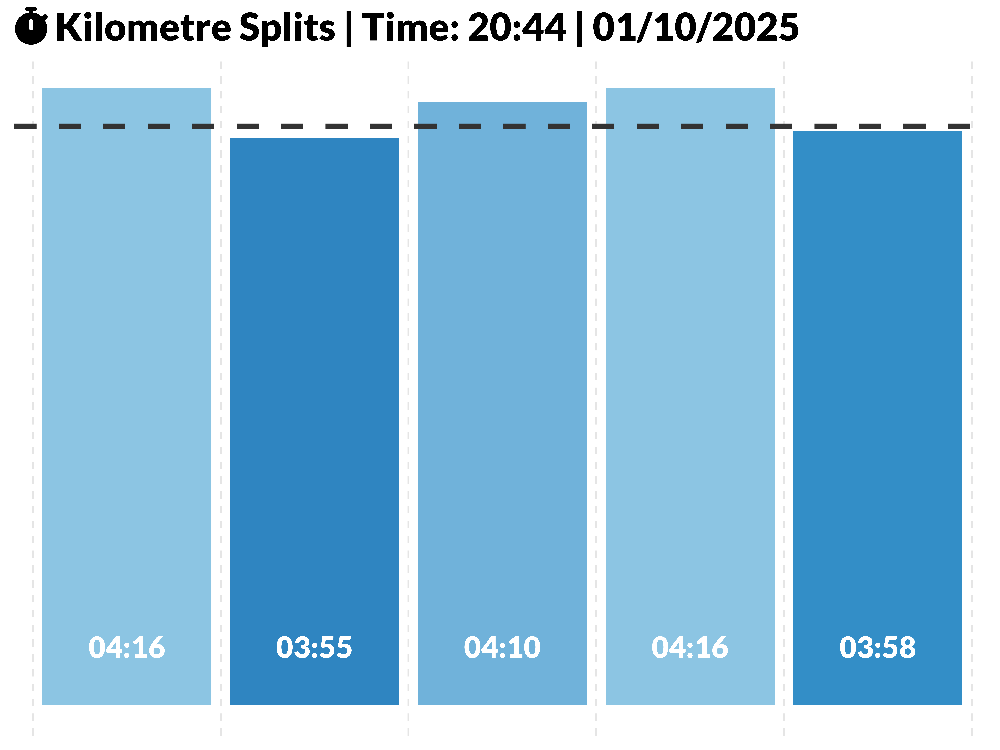
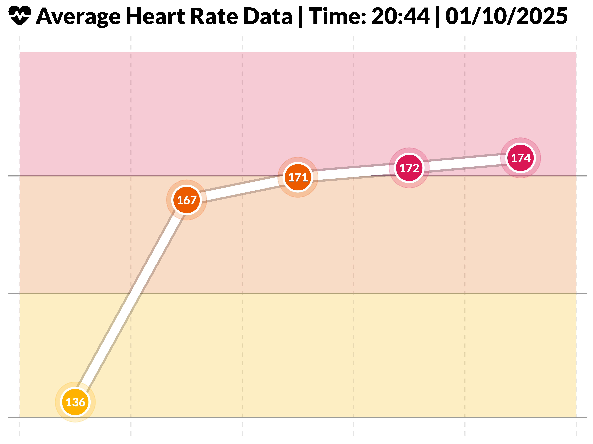
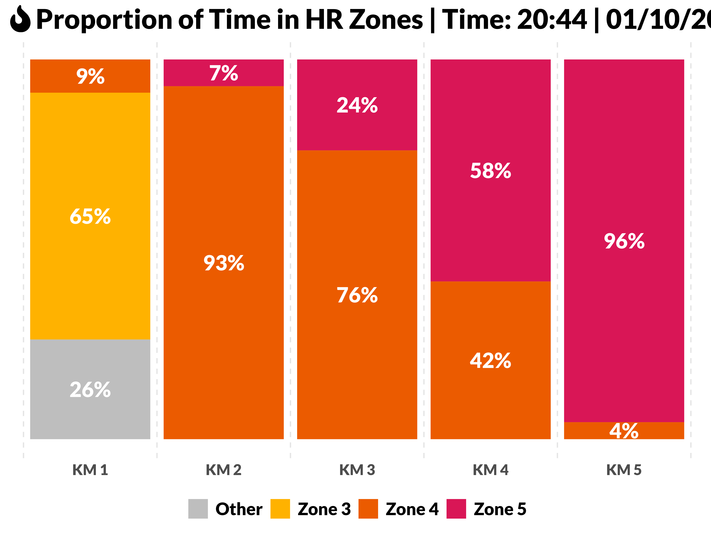

# Garmin TCX Activity Plotter

This Plot_Runs.R script processes Garmin `.tcx` running activity files and generates performance charts for each run. It is designed to work from the command line, taking one or more `.tcx` files as input and producing a set of PNG charts per activity.

### 📊 Example Output


---

## 📦 Features

For each running activity, the script generates **four charts**:

1. **Kilometre Split Times (Top Chart)**  
   - Bar chart showing the time taken for each kilometre.
   - Helps identify faster or slower segments.

2. **Heart Rate per Kilometre (Middle Chart)**  
   - Line chart with points representing each kilometre.
   - Displays the **average heart rate** on top of each point.
   - Provides insight into effort distribution across the run.

3. **Heart Rate Zones (Bottom Chart)**  
   - Stacked bar chart showing the proportion of time spent in different heart rate zones.  
   - Color coding:  
     - Zone 1–2 / Other: Gray  
     - Zone 3: Yellow  
     - Zone 4: Orange  
     - Zone 5: Red  

4. **Combined Chart**  
   - Vertically stacked version of the three charts above, saved as a single PNG for easy viewing.

> **Note:** The script uses Font Awesome icons in plot titles. Ensure that the Font Awesome font is installed locally before running the script.

---

## ⚙️ Usage

Run the script from the terminal:

```bash
Rscript Plot_Runs.R <tcx_files> <output_root>
```

- `<tcx_files>`: One or more `.tcx` files (e.g., `./activities/*.tcx`)  
- `<output_root>`: Directory where the charts will be saved (will be created if it doesn’t exist)

### Example:

```bash
Rscript Plot_Runs.R ./activities/*.tcx ./Charts
```

This will create a folder structure like:

```
Charts/
├── 2025-10-01T11_23_52+00_00_20556010525/
│   ├── 2025-10-01T11_23_52+00_00_20556010525_hr.png
│   ├── 2025-10-01T11_23_52+00_00_20556010525_km_splits.png
│   ├── 2025-10-01T11_23_52+00_00_20556010525_hr_zones.png
│   └── 2025-10-01T11_23_52+00_00_20556010525_combined.png
```

---

## 🏁 Getting Started

1. **Clone the repository:**

```bash
git clone https://github.com/<username>/garminTCXPlotter.git
cd garminTCXPlotter
```

2. **Initialize the R environment and install packages:**

You can use the provided `init.R` script to install all required packages and load them automatically.

```r
source("R/init.R")
init()
```

> This will install missing dependencies, load all packages, and check for Font Awesome availability.

3. **Test with the included sample activity:**

```bash
Rscript Plot_Runs.R ./activities/2025-10-01T11/23/52+00/00_20556010525.tcx ./Charts
```

This will generate the four charts for the sample activity in `./Charts/2025-10-01T11_23_52+00_00_20556010525/`.

---

## ✅ Behavior

- Automatically **skips non-running activities** based on the `Sport` attribute in the `.tcx` file.  
- Creates subdirectories for each activity within the specified output root.  
- Handles Garmin TCX namespaces automatically to reliably detect activities.  
- Uses icons from Font Awesome in plot titles for enhanced visualization.  

---

## 📦 Dependencies

The following R packages are required and handled by `init.R`:

- xml2
- dplyr
- ggplot2
- tidyverse
- showtext
- shadowtext
- ggborderline
- ggtext
- fontawesome
- rvest
- patchwork
- tools

> **Font note:** Font Awesome must be installed locally for the script to render icons correctly.

---

## 📝 Notes

- The script calculates **average heart rate per kilometre** for display on the middle chart.  
- Heart rate zones are categorized according to standard zones (Zone 1–5). Ensure your TCX file includes `HeartRateBpm` data.  
- Time formats, distance, and other metrics are automatically computed from the trackpoints in the `.tcx` file.

---

## 📖 License

MIT License – Feel free to reuse and adapt for your own running analysis.

---

## 👋 Contribution

Contributions and improvements are welcome! Please submit issues or pull requests on the GitHub repository.

---

## 📂 Sample Activity Included

The repository includes a sample activity located at:

```
activities/2025-10-01T11/23/52+00/00_20556010525.tcx
```

Use this file to test the script and generate sample charts.

---

## 🛠️ `init.R` Script

The `R/init.R` script provides an `init()` function that:

1. Checks for missing R packages and installs them.
2. Loads all required packages into the session.
3. Ensures Font Awesome is available for plot titles.

### Usage:

```r
source("R/init.R")
init()
```

This makes it easy for new users to set up all dependencies with a single command, similar to a Python `requirements.txt` workflow.

---

## 🖼️ Sample Output

Here are example charts generated from the included sample activity:

**1. Kilometre Split Times**  


**2. Heart Rate per Kilometre**  


**3. Heart Rate Zones**  


**4. Combined Chart**  


