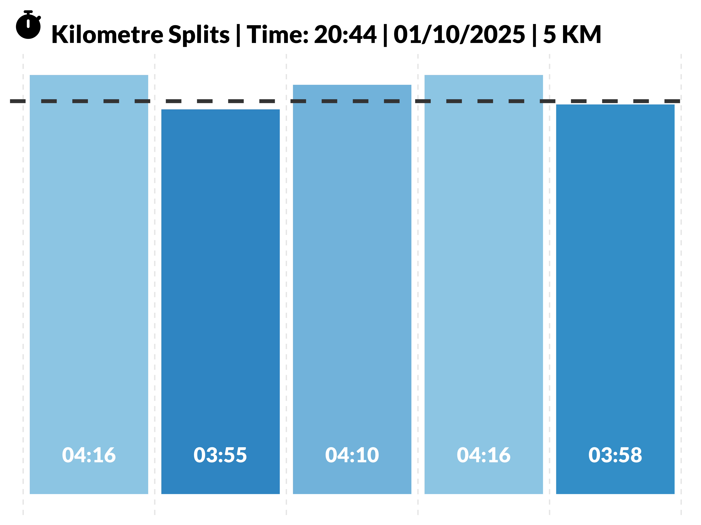

# fitnessPlotter

[](https://github.com/andypetes94/fitnessPlotter/actions/workflows/R-CMD-check.yaml)
[](https://cran.r-project.org/)
[](https://andypetes.shinyapps.io/fitnessPlotter/)
[](LICENSE)

Run visualisation & performance analytics tool built with **R Shiny**, designed for runners, HIIT, and HYROX enthusiasts.

---

## 📌 About

`fitnessPlotter` allows you to upload your Garmin `.tcx` files and visualize:

* Pace splits per kilometer
* Heart rate per km / per circuit
* Heart rate zones
* Combined summary plots
* Map of your run
* HYROX interval comparisons (manual or from Garmin/TCX data)

The app automatically generates **publication-ready plots**, with intuitive color coding for faster/slower splits.

---

## 🖥 Features

### Run Activities

* Upload a `.tcx` file from Garmin
* Visualize pace, heart rate, and combined plots
* Interactive tables and plots with download options

### Cardio / HIIT

* Upload cardio `.tcx` files
* Circuit-based heart rate visualization
* Combined summary plots

### HYROX Workouts

* Compare splits vs average
* Manual entry for missing or custom HYROX splits
* Download individual or combined plots

---

## 📊 Sample Output

Below are sample output charts generated from a sample `.tcx` file:

| Chart Type | Example |
|-------------|----------|
| Pace Splits |  |
| HR Line |  |
| HR Zones |  |
| Combined View |  |
| HR Bins |  |
| HYROX Splits |  |
| Combined HYROX |  |

---

> You can generate your own outputs by uploading your `.tcx` files.

---

## 🚀 Run the App

### Option 1: ShinyApps.io

[Launch fitnessPlotter](https://andypetes.shinyapps.io/fitnessPlotter/)

### Option 2: Locally in R

```R
# Clone the repo
git clone https://github.com/andypetes94/fitnessPlotter.git
setwd("fitnessPlotter")

# Install dependencies
install.packages(c("shiny", "bslib", "shinyWidgets", "shinycssloaders", "patchwork",
                   "ggplot2", "dplyr", "fontawesome", "fresh", "tmap", "sf",
                   "shinydashboard", "fuzzyjoin", "DT"))

# Run app
shiny::runApp("app.R")
```

### Option 3: RStudio Cloud

[](https://rstudio.cloud/project/)

---

## 🏋️ HYROX Workouts Explained

HYROX is a functional fitness race combining running with various gym-style workouts:

* Run segments between each workout
* Stations include SkiErg, Sled Push/Pull, Burpees, Rowing, Carry, Lunges, Wall Balls
* `fitnessPlotter` allows:

  * Comparison of your times vs average
  * Visualization of faster/slower splits
  * Manual input for personal HYROX plans

---

## 🧰 Dependencies

* `shiny`, `shinydashboard`, `bslib`
* `ggplot2`, `patchwork`, `dplyr`
* `tmap`, `sf` for mapping
* `shinyWidgets`, `shinycssloaders`, `DT`
* `fuzzyjoin`, `fontawesome`, `fresh`

All required packages are listed in `app.R` and can be installed via CRAN.

---

## ⚡ License

This project is licensed under the **MIT License**. See [LICENSE](LICENSE) for details.

---

## 📬 Contact

Created by [Andy Petes](https://github.com/andypetes94)
For feedback, issues, or feature requests, please open an issue on GitHub.

